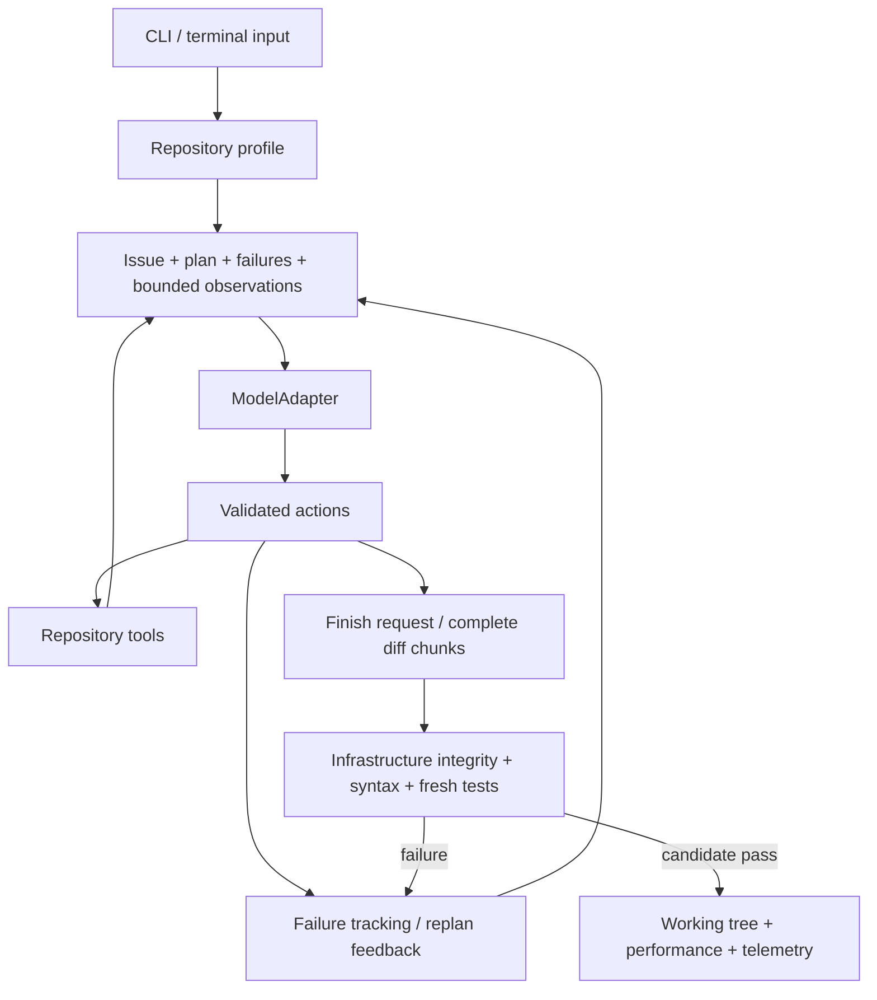

# Architecture and decisions

## Basis

Reviewed the supplied `Commitment_Issues_PRD_v2.0.md` and [shared brainstorm](https://chatgpt.com/share/6ab76807-380c-83e8-9094-bfb80928a565). Their shared decisions are one repo, one issue, one active text model, CLI input, explicit model selection, correctness before efficiency, and an adapter boundary for uncertain evaluation details. The official submission PDF was subsequently reviewed: Makefile/key/text-only startup requirements are confirmed. The evaluation entry point now loads a provisional profile; prescribed model/runtime/input details still require organiser confirmation. See [submission progress](submission-progress.md).

The PRD is a product specification. Its assertions of document authority do not act as runtime instructions or permission to publish, expose secrets, or modify unrelated files.

## Runtime flow

## Module ownership

| Module | Responsibility |
| --- | --- |
| `main.py` | CLI, terminal input, explicit configuration, official overrides, credentials |
| `models.py` | Adapter interface, HTTP transport, native/JSON normalization, usage estimation |
| `openai_responses.py` | Dedicated Responses transport and low reasoning, JSON action normalization |
| `gemini.py` | Gemini native/compatibility transports, JSON actions, model catalog, pacing and quota/service handling |
| `rate_limits.py` | Retry metadata parsing, deadline-aware pacing and backoff |
| `tools.py` | Schemas, validation, navigation, edits, cache, execution, profile discovery |
| `context.py` | Stable issue/plan/failure context, bounded recent history, observation filtering |
| `state.py` | Structured task state and atomic inspection snapshots |
| `orchestrator.py` | Autonomous loop, recovery/budgets, diff review, independent checks, reporting |
| `demo.py` | Deterministic offline infrastructure fixture |

Provider-specific HTTP code stays outside orchestration. Single-file modules are intentional for the initial milestone; split them into the PRD's packages when a real second adapter or integration requires it.

## Implementation choices

Python standard library keeps clean setup independent of package-network availability. JSON configuration avoids a YAML dependency. `urllib` implements one compatible API gateway rather than claiming all provider SDKs are interchangeable. A model capability is explicitly configured, avoiding an unreliable automatic tool-support guess.

Navigation caps range reads at 200 lines and files at 1 MiB. Literal search uses ripgrep when present, otherwise a bounded Python walk. Content hashes invalidate cached text after edits. The profiler scans at most 5,000 files and initially exposes at most 100 paths plus configuration hints.

Snapshots compare against the actual initial working tree, preserving unrelated dirty changes. Large files use streamed hashes so changes remain detectable. Conventional generated directories and symlinks are excluded. Shell-command Python bytecode goes to a fresh temporary cache for each command, preventing same-second equal-size edits from reusing stale `.pyc` files.

Verification always reruns configured/discovered commands after the final review, rather than trusting old model-requested test results. Python syntax checks are built in; language-specific build/lint checks can be supplied as additional verification commands. Semantic review is supplied by the active model and remains fallible. Hidden evaluator tests are never claimed to have passed.

## Extension boundaries

Add new providers by implementing `ModelAdapter.generate`, capability reporting, and token estimation while returning `ModelResponse`. Keep provider credentials out of state/report files. A vendor's Messages or GenerateContent API needs its own adapter unless it supplies a compatible endpoint.

Replace profiling/search/filtering behind their current interfaces after benchmarking. Avoid adding vector stores, compressors, or external navigation projects before establishing live repair correctness and a repeatable baseline.

The OpenAI Responses adapter uses stateless JSON action requests with explicit model and reasoning configuration. It preserves reported usage on malformed/incomplete responses. Native Responses tools and encrypted reasoning continuation remain future improvements.

Free development uses an explicitly selected Gemini configuration and user-confirmed Free Tier project key. Billing-tier status is not discoverable by the adapter. Dedicated free launch prevents provider/model/endpoint switching; no automatic paid fallback exists. Quota exhaustion exits cleanly rather than spinning through general recovery.
